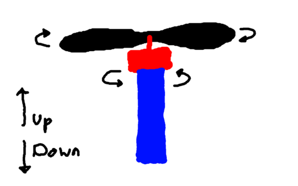
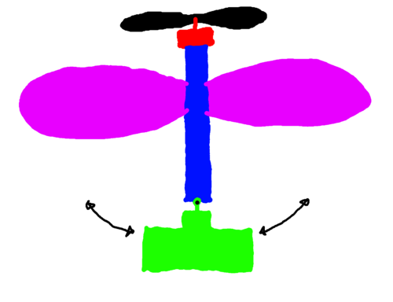
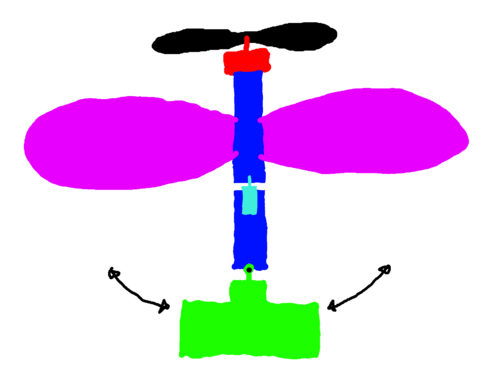
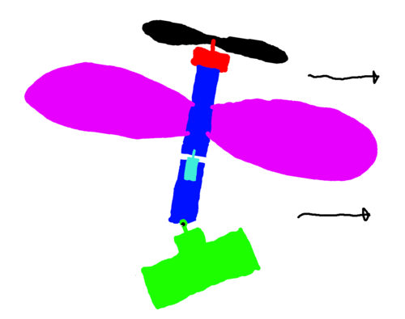
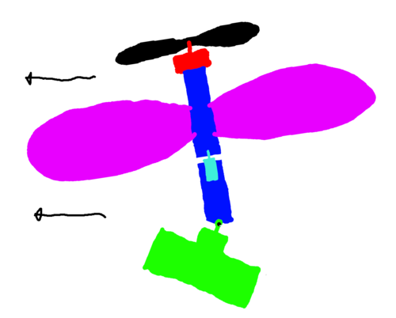

# Crazy Drone Project

This is a project to build a one-propeller drone, according to some
crazy idea I had. 

Will it work? No.

## Concept

(NOTE: The following diagrams are the view of the drone from side on,
so up in the diagram is up in real life.)

The first problem with a one-propeller drone is that the angular
momentum of the blade when it starts spinning causes the body to begin
to spin in the opposite direction:

(Black - propeller, red - fast motor, blue - base)

Conventional quadcopters fix this by having an equal number of blades
spinning clockwise as anticlockwise, meaning the total angular
momentum is 0. However this isn't possible with only one propeller.

Solution: Let it spin!

Instead of trying to stop the drone from spinning, we will let it
spin, but limit the spin by giving the drone...

Wings! The drone will have large wings on its body, which will limit
the rotation speed due to their air resistance.

The second problem we face is that we have no way to control the
movement of the drone. Our solution to this is to place the battery
and electronics (which will act as a sort of weight) in a section at
the bottom of the drone, and have this section controlled by a servo
such that it can be made to tilt. When the weight is tilted, the angle
of the upper body from the vertical will change. How? I'm not entirely
sure. But it will probably change somehow, and if we can calculate
this, then the drone's speed can be controlled.

Now we have a third problem arising from my solutions to the first and
second problems. That is: if the body of the drone is spinning, and
the drone's direction is controlled by the weight distribution of the
body, then the drone will be doomed to travel in circles forever and
ever!

My solution here is a third motor (light blue), separating the lower
base (with the servo and electronics) from the upper base (the bit
with the wings that spins). A gyroscope sensor in the lower base can
be used to control the motor's speed, adjusting so that it spins just
fast enough to keep the lower base stationary.

This motor serves an additional function: rotating this motor faster /
slower than required will allow the lower base to be rotated (relative
to the external reference frame), meaning the drone can change
direction.

And so the final result, demonstrating how I anticipate it will move:

## Project Status

This project is currently just an idea - I haven't begun work on
it.
